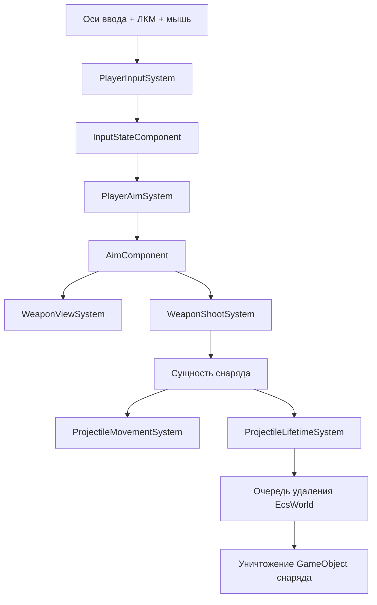

# Поток боя игрока

Документ описывает реальный путь от ввода игрока до очистки снаряда.

Связанные документы: [Цикл выполнения](runtime-loop.md), [Компоненты ECS](../models/ecs-components.md), [Обработка ошибок](../errors/error-handling.md).

## Пошаговый поток
1. `PlayerInputSystem` читает оси клавиатуры (`Horizontal`, `Vertical`), позицию и состояние мыши.
2. `PlayerAimSystem` вычисляет нормализованный вектор прицеливания от игрока к курсору.
3. `WeaponViewSystem` гарантирует наличие визуального объекта оружия и поворачивает его в сторону прицела.
4. `WeaponShootSystem` проверяет ЛКМ + cooldown и создает сущность снаряда с transform и projectile-компонентами.
5. `ProjectileMovementSystem` двигает снаряд каждый физический тик.
6. `ProjectileLifetimeSystem` уменьшает время жизни и помечает сущность снаряда на удаление.
7. `EcsWorld` во время flush удаляет сущность и уничтожает связанный GameObject.

## Диаграмма потока данных

## Важные связности
- Скорострельность использует `Time.time`; поведение зависит от глобальных часов Unity.
- Прицеливание зависит от `Camera.main`; отсутствие правильно помеченной камеры отключает путь ввода.
- Визуал снарядов создается динамически; пул объектов пока не реализован.

Для зависимостей от движка и настроек см. [Конфигурация](../config/configuration.md). Для контроля качества см. [Стратегия тестирования](../testing/testing-strategy.md).
