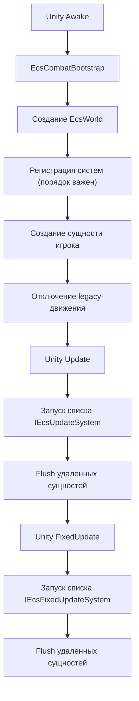

# Цикл выполнения

Документ описывает, как callbacks жизненного цикла Unity запускают кастомный ECS-планировщик.

Связанные документы: [Обзор архитектуры](../architecture/overview.md), [Поток боя игрока](player-combat-flow.md), [Компоненты ECS](../models/ecs-components.md).

## Последовательность выполнения
1. Unity загружает сцену.
2. `EcsCombatBootstrap.Awake()`:
   - валидирует transform игрока
   - создает `EcsWorld`
   - регистрирует системы в фиксированном порядке
   - создает сущность игрока с компонентами
   - отключает legacy-скрипт движения на объекте игрока
3. Каждый кадр (`Update`): мир выполняет цепочку `IEcsUpdateSystem`.
4. Каждый физический тик (`FixedUpdate`): мир выполняет цепочку `IEcsFixedUpdateSystem`.
5. В конце каждого тика мира: flush отложенного удаления сущностей.

## Диаграмма планировщика

## Текущий порядок систем
- Цепочка Update:
  - `PlayerInputSystem`
  - `PlayerAimSystem`
  - `WeaponViewSystem`
  - `WeaponShootSystem`
  - `ProjectileLifetimeSystem`
- Цепочка Fixed:
  - `PlayerMovementSystem`
  - `ProjectileMovementSystem`

Детали зависимостей от порядка см. в [Обработка ошибок](../errors/error-handling.md) и [Стратегия тестирования](../testing/testing-strategy.md).
