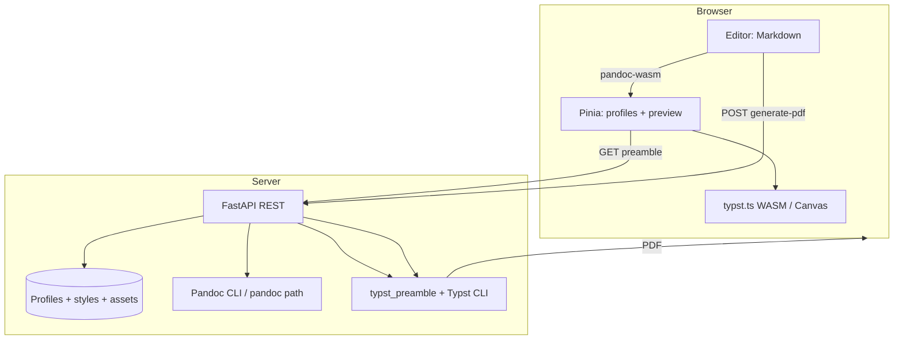

# Архитектура

Данный раздел описывает общую архитектуру системы, основные компоненты, потоки данных и принятые границы ответственности. Детальные сценарии: [потоки на backend](Backend/DataFlows.md), [пайплайн рендеринга](Frontend/RenderingPipeline.md), [обработка документов](DocumentProcessing/Overview.md), [настройка окружения](Development/Setup.md).

## Логическая схема (компоненты)

```mermaid
graph TD
  Client[Браузер] --> Frontend[Vue.js Frontend]
  Frontend --> Backend[FastAPI Backend]
  Backend -- CRUD --> Database[PostgreSQL/SQLite]
  Backend -- Typst Compile --> TypstCLI[Typst CLI]
  Backend -- Pandoc Convert --> PandocCLI[Pandoc CLI]
  TypstCLI -- PDF Output --> Client
  Frontend -- WASM Render --> TypstTS[typst.ts (WASM)]
  TypstTS -- Canvas Output --> Frontend
```

## DFD: документ и стили (упрощённо)



Канонические **численные** дефолты и вынесенные **константы** преамбулы: [Constants.md](Constants.md).

## Обзор компонентов

### Frontend (Vue.js Frontend)

Клиентская часть приложения, реализованная на Vue.js 3, с использованием Pinia для управления состоянием и Tailwind CSS для стилизации. Отвечает за пользовательский интерфейс, редактор Markdown, предпросмотр документов и взаимодействие с Backend API.

### Backend (FastAPI Backend)

Серверная часть приложения, построенная на FastAPI (Python). Обрабатывает запросы от Frontend, управляет данными в базе данных через SQLAlchemy, взаимодействует с внешними утилитами Typst CLI и Pandoc CLI для конвертации и компиляции документов.

### Database (PostgreSQL/SQLite)

База данных, используемая для хранения профилей пользователей, стилей документов, титульных страниц и другой метаинформации. Управление схемой базы данных осуществляется с помощью Alembic.

### Typst CLI

Внешняя утилита командной строки, используемая Backend для компиляции `.typ` файлов в PDF-документы. Предоставляет высококачественный типографский рендеринг.

### Pandoc CLI

Внешняя утилита командной строки, используемая Backend для конвертации Markdown-текста в исходный код Typst.

### typst.ts (WASM Module)

WebAssembly модуль, используемый Frontend для рендеринга Typst-кода непосредственно в браузере. Позволяет отображать живой предпросмотр документа без необходимости обращаться к Backend.

## Взаимодействие компонентов

1.  **Пользовательское взаимодействие:** Пользователь взаимодействует с Frontend через браузер.
2.  **Frontend - Backend API:** Frontend отправляет запросы к Backend API для управления профилями, стилями, загрузки файлов и запуска генерации PDF.
3.  **Backend - База данных:** Backend выполняет операции CRUD (Create, Read, Update, Delete) с базой данных для сохранения и извлечения данных о профилях и стилях.
4.  **Backend - Утилиты:** Для генерации PDF, Backend вызывает Pandoc CLI для конвертации Markdown в Typst, а затем Typst CLI для компиляции Typst в PDF.
5.  **Frontend - typst.ts (WASM):** Для живого предпросмотра, Frontend передает Typst-код (полученный от Backend и сконвертированный из Markdown) модулю `typst.ts`, который рендерит его на HTML Canvas.

Далее: [Обзор Backend](Backend/Overview.md) · [Оглавление WIKI](SUMMARY.md)