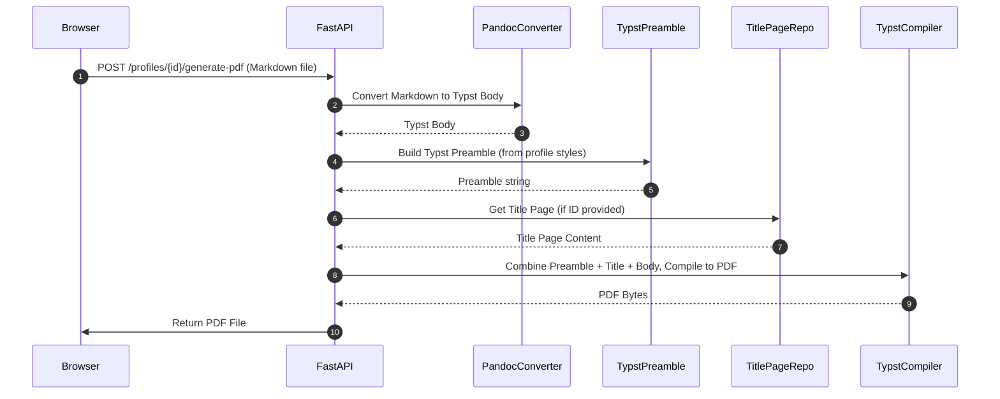

# Потоки данных на Backend

В этом разделе описываются ключевые потоки данных на Backend, включая обработку запросов на генерацию документов и взаимодействие с базой данных.

## Поток генерации PDF (POST /profiles/{profile_id}/generate-pdf)

1.  **Запрос от браузера:** Frontend отправляет HTTP POST запрос на эндпоинт `/profiles/{profile_id}/generate-pdf`, содержащий Markdown-файл и, опционально, ID титульной страницы.
2.  **Конвертация Markdown в Typst Body:** FastAPI вызывает внутреннюю утилиту [PandocConverter](../../app/utils/pandoc_converter.py), которая использует Pandoc для преобразования содержимого Markdown-файла в основную часть Typst-кода (`typst_body`).
3.  **Формирование Typst Preamble:** FastAPI обращается к [TypstPreamble](../../app/utils/typst_preamble.py) для создания строки Typst-преамбулы (`preamble`) на основе стилей, связанных с указанным `profile_id`.
4.  **Получение титульной страницы (опционально):** Если в запросе указан `title_page_id`, FastAPI запрашивает содержимое титульной страницы у [TitlePageRepository](../../app/repositories/title_page_repository.py).
5.  **Компиляция в PDF:** FastAPI объединяет `preamble`, содержимое титульной страницы (если есть) и `typst_body` в полный Typst-исходник. Затем этот исходник передается в [TypstCompiler](../../app/utils/typst_compiler.py), который использует Typst CLI для компиляции в PDF.
6.  **Возврат PDF:** Сгенерированные байты PDF-файла возвращаются в браузер как HTTP-ответ.

## Поток сохранения/обновления стилей (POST/PATCH/PUT /profiles/{profile_id}/{element_type})

1.  **Запрос от браузера:** Frontend отправляет HTTP POST/PATCH/PUT запрос на соответствующие эндпоинты управления стилями элементов (например, `/profiles/{profile_id}/par`) с JSON-телом, содержащим данные стиля.
2.  **Валидация данных:** FastAPI использует Pydantic-модели ([`app/models/pydantic/`](../../app/models/pydantic/)) для валидации входящих данных.
3.  **Сохранение/обновление в БД:** Через [фабрику роутеров элементов](../../app/api/elements/factory.py) и соответствующие [StyleRepository](../../app/repositories/style_repository.py), данные стиля сохраняются или обновляются в базе данных. При этом Pydantic-модели преобразуются в SQLAlchemy ORM-модели ([`app/models/sqlalchemy/styles/`](../../app/models/sqlalchemy/styles/)).
4.  **Обработка `text_override`:** Если стиль элемента поддерживает `text_override`, вызывается функция `apply_text_override` ([`app/api/elements/text_override.py`](../../app/api/elements/text_override.py)) для создания, обновления или удаления соответствующей записи в таблице `text_override_styles`.
5.  **Ответ:** Обновленные данные стиля возвращаются в браузер.

Далее: [База данных](Database.md)