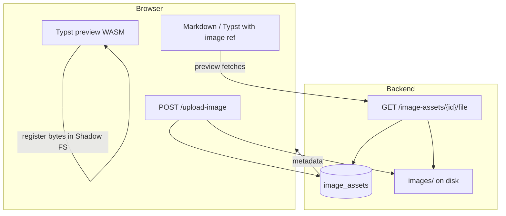

# Изображения и ассеты

В документе изображения появляются в Typst как вызовы `image("...")`. В проекте различают **URL с backend** (загруженные в БД файлы), **локальные пути** под префиксом `images/` (хранилище на сервере) и **внешние** `http(s)`/data-URI.

## DFD: загрузка и использование

## API загрузки и отдачи

- **`POST /upload-image`** — [`app/api/upload.py`](../../app/api/upload.py): сохраняет файл в `images/`, создаёт запись в `image_assets`.
- **`GET /image-assets/{asset_id}/file`** — отдаёт байты для вставки в документ (и для [превью](../Frontend/RenderingPipeline.md), где `fetch` кладёт данные в виртуальную ФС `typst.ts`).
- **`GET /image-assets`** — список метаданных (отладка/UI при необходимости).

## Серверная генерация PDF

[`typst_compiler.py`](../../app/utils/typst_compiler.py) извлекает из исходника пути `image("...")`, для путей вида `images/...` (без `..`) копирует соответствующие файлы из [`IMAGES_DIR`](../../app/api/upload.py) во временный root компиляции, чтобы `typst compile` видел те же относительные пути.

**Почему так:** Typst CLI работает в изолированном `tmpdir`; без копирования локальные ссылки были бы битыми.

## Клиентское превью

В [`TypstPreview.vue`](../../frontend/src/components/TypstPreview.vue) (см. [пайплайн рендеринга](../Frontend/RenderingPipeline.md)) изображения, на которые ссылается сгенерированный Typst, подгружаются по URL и регистрируются в shadow FS, чтобы WASM-компилятор обрабатывал их так же, как обычные файлы.

## Согласованность путей

- В Markdown/после Pandoc путём может оказаться ссылка на ассет API; для preview важен доступный с backend base URL.
- Для PDF пути `images/...` должны соответствовать реальным файлам в `images/` после загрузки.

Далее: [Обзор обработки документов](Overview.md)
