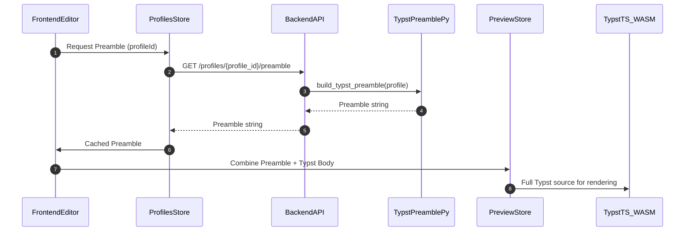

# Поток Typst-преамбулы

Typst-преамбула играет критическую роль в определении глобального стиля документа. Её формирование — это совместный процесс Backend и Frontend, который обеспечивает как серверную генерацию PDF, так и живой предпросмотр в браузере. 

## Диаграмма потока данных для Live Preview с преамбулой



## Детальное описание потока

1.  **Запрос преамбулы на Frontend**
    *   Когда пользователь выбирает профиль стилей в редакторе (или приложение загружается с последним выбранным профилем), компонент [`Editor.vue`](../../frontend/src/views/Editor.vue) через `profilesStore` ([`frontend/src/stores/profiles.ts`](../../frontend/src/stores/profiles.ts)) инициирует загрузку Typst-преамбулы для выбранного `profileId`.
    *   `profilesStore` сначала проверяет свой внутренний кэш (`styleCache`), чтобы избежать повторных запросов к Backend, если преамбула уже была загружена.

2.  **Генерация преамбулы на Backend**
    *   Если преамбулы нет в кэше, `profilesStore` отправляет HTTP GET запрос на Backend: `GET /profiles/{profile_id}/preamble` ([`app/api/generate.py`](../../app/api/generate.py)).
    *   Backend-эндпоинт вызывает функцию `build_typst_preamble(profile)` из модуля [`app/utils/typst_preamble.py`](../../app/utils/typst_preamble.py).
    *   Функция `build_typst_preamble` динамически формирует строку Typst-кода, используя данные из различных стилевых моделей, связанных с `profile` (например, `PageStyle`, `ParStyle`, `HeadingLevelStyle` и `TextOverrideStyle`). Она генерирует `#set` и `#show` правила, которые задают глобальные параметры документа.
    *   Сгенерированная строка преамбулы возвращается Backend в Frontend.

3.  **Кэширование и передача на Frontend**
    *   Frontend получает строку преамбулы и сохраняет её в `profilesStore.styleCache` для будущего использования.
    *   Затем эта кэшированная преамбула становится доступной для [`Editor.vue`](../../frontend/src/views/Editor.vue).

4.  **Объединение Typst-исходника для предпросмотра**
    *   В `Editor.vue`, после того как Markdown-текст был конвертирован в `typstBody` (с помощью `pandoc-wasm`), и преамбула была загружена/получена из кэша, они объединяются в одну строку `fullTypst`:
        ```typescript
        const fullTypst = (preamble ?? '') + '\n' + typstBody;
        ```
    *   Этот полный Typst-исходник устанавливается в `previewStore.typstSource` ([`frontend/src/stores/preview.ts`](../../frontend/src/stores/preview.ts)).

5.  **Рендеринг в браузере**
    *   Компонент [`TypstPreview.vue`](../../frontend/src/components/TypstPreview.vue) отслеживает изменения в `previewStore.typstSource`.
    *   При получении нового `fullTypst`, он передается WebAssembly-модулю `typst.ts` (`@myriaddreamin/typst.ts/contrib/snippet`), который компилирует и рендерит документ на HTML Canvas.
    *   Важно: Python-код `typst_preamble.py` **не исполняется в браузере**; туда передается только результат его работы — готовая строка Typst-преамбулы.

## Участие `typst_preamble.py` в клиентском предпросмотре

`app/utils/typst_preamble.py` исполняется **только на Backend**. Однако, он участвует в клиентском предпросмотре **опосредованно**, генерируя необходимую строку Typst-преамбулы, которую Frontend затем запрашивает через API и использует для компиляции документа в браузере.

Далее: [Typst в PDF](TypstToPDF.md)