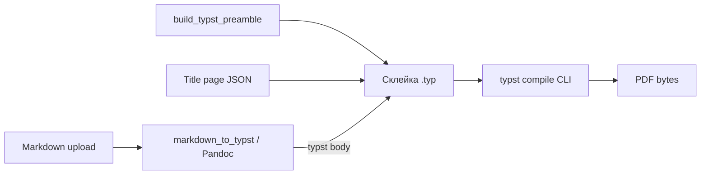

# Typst в PDF (серверная компиляция)

Серверная ветка превращает **полный Typst-исходник** (преамбула + опционально титул + тело) в **бинарный PDF** через **Typst CLI**. Браузер в этом пути **не** участвует: WASM `typst.ts` используется только для [превью](../Frontend/RenderingPipeline.md).

## DFD: от Markdown до PDF

## Почему отдельно от превью

- **Одинаковая преамбула** строится тем же `build_typst_preamble` ([`app/utils/typst_preamble.py`](../../app/utils/typst_preamble.py)), что и для `GET /profiles/{id}/preamble`, поэтому визуально PDF и preview стремятся согласованности.
- **Разные движки рендера:** в браузере — `typst.ts` (WASM), на сервере — `typst` из PATH. Мелкие отличия в шрифтах/хинтинге возможны, если окружения отличаются.
- **Качество и печать:** CLI-вывод обычно эталонен для финального артефакта; не нужно гонять большие PDF по сети для каждой правки — для этого [пайплайн превью](../Frontend/RenderingPipeline.md).

## Реализация в коде

1. **Эндпоинт:** [`POST /profiles/{profile_id}/generate-pdf`](../../app/api/generate.py) принимает `multipart/form-data` с полем `file` (`.md` / `.markdown` / `.txt`), опционально `title_page_id`. Валидация размера и расширения — в том же модуле.
2. **Тело документа:** [`markdown_to_typst`](../../app/utils/pandoc_converter.py) — Pandoc **внешний процесс** (не wasm).
3. **Преамбула:** `build_typst_preamble(profile)`.
4. **Титульная страница:** при необходимости подмешивается фрагмент из БД (или встроенный шаблон — см. комментарии в `generate.py` для спец-режимов).
5. **Компиляция:** [`compile_typst_to_pdf`](../../app/utils/typst_compiler.py) пишет `input.typ` во временный каталог, копирует локальные изображения по путям `images/...` из [`IMAGES_DIR`](../../app/api/upload.py), вызывает `typst compile input.typ output.pdf`, возвращает байты.

## Ошибки

- `TypstCompileError` / HTTP 500 — ненулевой код `typst`, тайм-аут 60 с, либо отсутствующие ассеты (см. логи и `stderr` в исключении).
- Шрифты: при неизвестном семействе API может отказать ещё до Typst (см. [Интеграция с Typst](../Backend/TypstIntegration.md)).

## Связанные разделы

- [Потоки данных на backend](../Backend/DataFlows.md) — sequence-диаграмма PDF.
- [Pandoc на backend](../Backend/PandocIntegration.md) — тело `.typ` из Markdown.
- [Изображения и ассеты](ImageAssets.md) — как пути в исходнике сопоставляются файлам на диске.

Далее: [Изображения и ассеты](ImageAssets.md)
