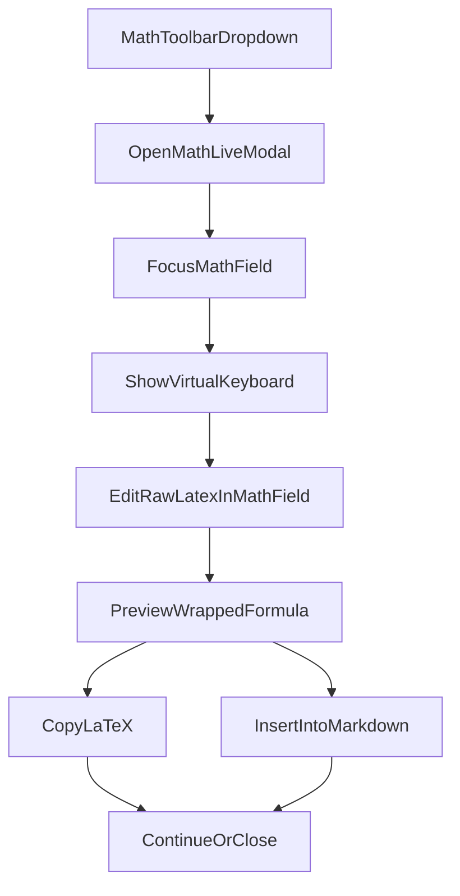
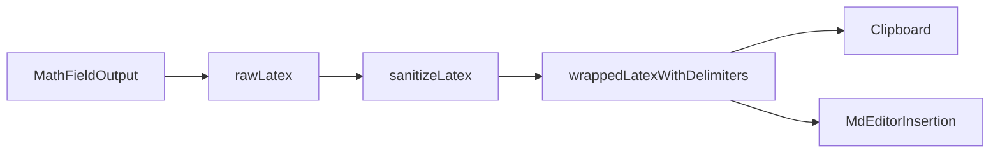

# MathLive Formula Builder

Компонент конструктора формул на базе `mathlive`, встроенный в тулбар `md-editor-v3`.
Основная цель: дать стабильный UX редактирования формул и гарантировать безопасный LaTeX на выходе для пайплайна Pandoc → Typst.

## Где находится

- UI-модалка: `frontend/src/components/MathLiveBuilderModal.vue`
- Кнопка тулбара: `frontend/src/components/MdEditorMathToolbar.vue`
- Подключение к редактору: `frontend/src/components/MdEditor.vue`
- Санитайзер: `frontend/src/utils/sanitizeLatex.ts`

## UX flow

## Data flow (raw vs sanitized)

Ключевой принцип: `rawLatex` — единственный источник истины для редактирования в MathLive.  
Санитайзер вызывается только в export-потоке (`copy` / `insert`), а не в hot-path ввода.

## Технические решения

### 1) Разделение слоёв данных

- Внутри модалки хранится `rawLatex`.
- Для предпросмотра и действий вычисляется `wrappedLatex` на основе `rawLatex`.
- Для копирования/вставки используется `getSanitizedWrappedLatex()`:
  1. `sanitizeLatex(rawLatex)`
  2. добавление `$...$` или `$$...$$` по `displayMode`.

Это сохраняет нативное поведение MathLive и исключает «порчу» пользовательского ввода во время набора.

### 2) Защита от циклов и прыжков курсора

Введён guard `isInternalUpdate` для двунаправленной синхронизации:

- `handleMathInput()` игнорирует события, когда обновление инициировано программно.
- `watch(rawLatex)` перед записью `field.value` включает `isInternalUpdate`, затем сбрасывает через `queueMicrotask()`.

Это предотвращает race-condition и cursor-jump при внешних/асинхронных обновлениях.

### 3) Надёжный lifecycle фокуса и клавиатуры

Открытие модалки выполняется атомарно:

1. `await customElements.whenDefined('math-field')`
2. `field.focus()`
3. `requestAnimationFrame(() => window.mathVirtualKeyboard?.show())`

Такой порядок стабилен для custom element upgrade и снижает риск «серой»/неактивной клавиатуры.

### 4) Поведение при закрытии

Добавлен флаг `shouldResetOnClose`:

- при `true`: очищаются `rawLatex` и `displayMode`;
- при `false`: можно сохранить контекст для reopen-сценариев.

Feedback-стейт («Скопировано») реализован через `useTimedState()` с централизованным таймером.

### 5) Проблемы перекрытия клавиатуры

Чтобы виртуальная клавиатура оставалась доступной:

- у `math-virtual-keyboard` поднят слой (`z-index`);
- у внешнего fullscreen-контейнера модалки отключён перехват (`pointer-events-none`);
- у карточки модалки оставлен `pointer-events-auto`;
- удалено затемнение fullscreen-backdrop, которое визуально «темнило» клавиатуру.

## Санитайзер LaTeX

`sanitizeLatex(input)` нормализует формулы до safe-подмножества, совместимого с Pandoc/Typst.

Основные преобразования:

- `\dfrac`, `\tfrac`, `\cfrac` → `\frac`
- удаление `\left`, `\right`, `\big`, `\Big`, `\bigl`, `\bigr`, `\bigm`
- `\bigm|`, `\middle|` → `|`
- удаление spacing-команд: `\!`, `\,`, `\:`, `\;`, `\quad`, `\qquad`
- `\operatorname{...}` → `...`
- `\text{...}` → `...`
- `\overset{a}{b}` → `b^{a}`
- `\underset{a}{b}` → `b_{a}`
- `\binom{a}{b}` → `(a, b)`
- нормализация пробелов

Что не меняется:

- переменные;
- индексы;
- структура дробей.

## Интеграция в редактор

- В `MdEditorMathToolbar` добавлен пункт `MathLive` в dropdown.
- В `MdEditor` модалка открывается по событию `openMathLive`.
- Кнопка `Вставить` отправляет санитайзенный LaTeX в текущую позицию курсора через `insert`.
- Переключатель `Копировать как block ($$...$$)` влияет и на copy, и на insert.
